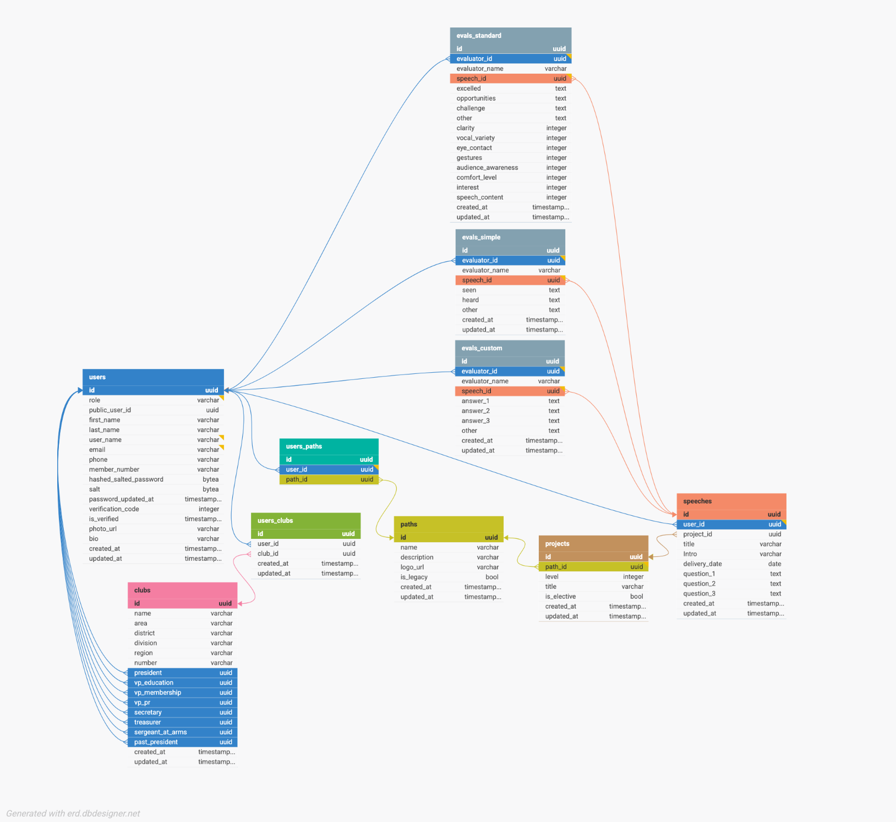

# Evaluation Forum

## What it is
An app for requesting, guiding, and providing feedback.

## How to use it

Go to [https://evaluation.forum](https://evaluation.forum) and create an account.

## How to run it

### Requirements
  - Node.js v20 or greater
  - Postgres v16 or greater

### Steps
  - Clone the repo
  - run 

### Setup the Database

